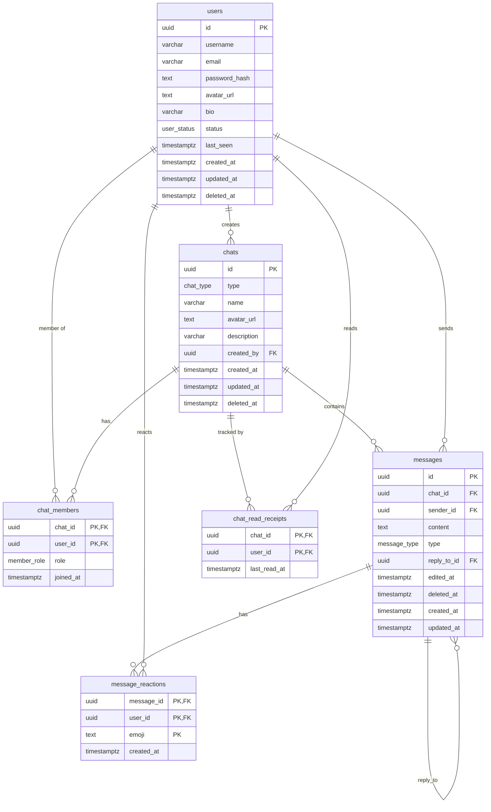

```mermaid
erDiagram
    users {
        uuid        id              PK
        varchar     username
        varchar     email
        text        password_hash
        text        avatar_url
        varchar     bio
        user_status status
        timestamptz last_seen
        timestamptz created_at
        timestamptz updated_at
        timestamptz deleted_at
    }

    chats {
        uuid        id              PK
        chat_type   type
        varchar     name
        text        avatar_url
        varchar     description
        uuid        created_by      FK
        timestamptz created_at
        timestamptz updated_at
        timestamptz deleted_at
    }

    chat_members {
        uuid        chat_id         PK, FK
        uuid        user_id         PK, FK
        member_role role
        timestamptz joined_at
    }

    messages {
        uuid         id             PK
        uuid         chat_id        FK
        uuid         sender_id      FK
        text         content
        message_type type
        uuid         reply_to_id    FK
        timestamptz  edited_at
        timestamptz  deleted_at
        timestamptz  created_at
        timestamptz  updated_at
    }

    message_reactions {
        uuid        message_id      PK, FK
        uuid        user_id         PK, FK
        text        emoji           PK
        timestamptz created_at
    }

    chat_read_receipts {
        uuid        chat_id         PK, FK
        uuid        user_id         PK, FK
        timestamptz last_read_at
    }

    users         ||--o{ chats              : "creates"
    users         ||--o{ chat_members       : "member of"
    chats         ||--o{ chat_members       : "has"
    chats         ||--o{ messages           : "contains"
    users         ||--o{ messages           : "sends"
    messages      ||--o{ messages           : "reply_to"
    messages      ||--o{ message_reactions  : "has"
    users         ||--o{ message_reactions  : "reacts"
    chats         ||--o{ chat_read_receipts : "tracked by"
    users         ||--o{ chat_read_receipts : "reads"
```
